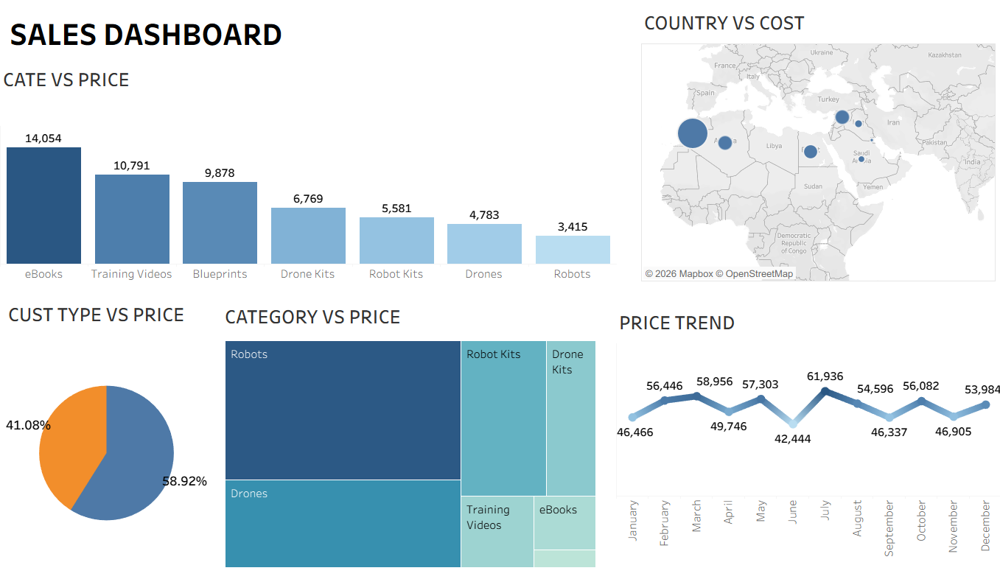

# 🛒 Tech & Educational Sales Dashboard

## Tableau Project

## 📄 Overview
This project analyzes the sales and pricing performance of a technology and educational product store. The dashboard provides clear insights into category pricing, customer type distribution, geographic cost analysis, and monthly price trends to help optimize product offerings and sales strategies.

## 🖼️ Dashboard Preview

## 🔑 Key Metrics
* *Top Category (by Price):* eBooks (14,054)
* *Peak Trend Value:* 61,936 (August)
* *Lowest Trend Value:* 42,444 (June)
* *Dominant Customer Segment:* 58.92% of total

## 🚀 Main Insights

* *📈 Price & Sales Trends:* Performance reached its absolute peak in *August* hitting *61,936, following a noticeable dip in June (42,444*).
* *📚 Top Performing Categories:* Educational content leads the metrics, with *eBooks (14,054)* and *Training Videos (10,791)* being the highest, followed by *Blueprints (9,878)*. 
* *🤖 Hardware vs. Software:* While software/educational materials lead the bar chart, the treemap highlights significant volume in hardware like *Robots* and *Drones*.
* *👥 Customer Segmentation:* The customer base is split into two main types, with the primary segment making up *58.92%* of the distribution, showing a clear preference or target audience.
* *🌍 Geographic Cost Distribution:* The map visualization indicates specific regional concentrations for costs across different countries, allowing for targeted geographic strategies.
*
